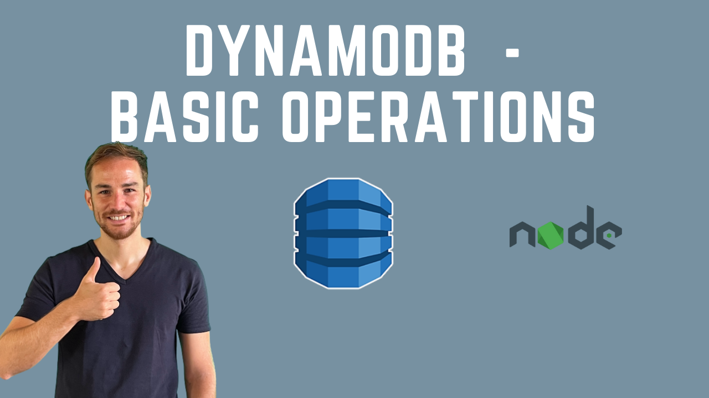

# DynamoDB Basic Operations with NodeJS

This repo is an example on how to integrate AWS DynamoDB Library using Lambda and NodeJS. I have implemented the four basic operations: 

1. Get Item
2. Save Item
3. Delete Item
4. Update Item

You can follow the tutorial on my Youtube channel:

